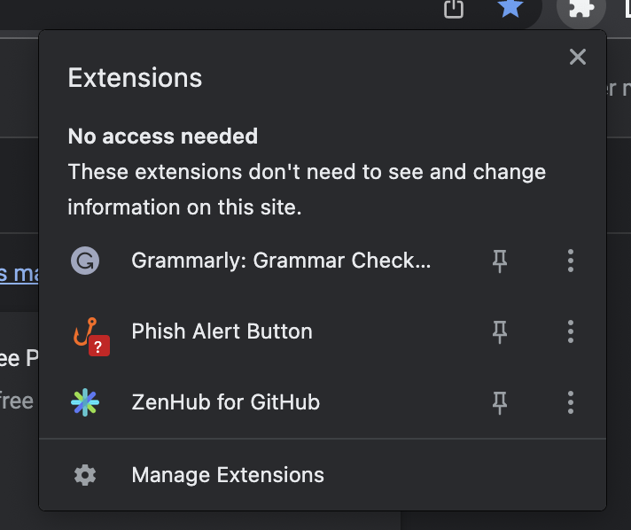

# MetaMask Security Mask

Welcome to the Security Mask installation steps.

## Building locally

- Install [Node.js](https://nodejs.org) version 16
  - If you are using [nvm](https://github.com/nvm-sh/nvm#installing-and-updating) (recommended) running `nvm use` will automatically choose the right node version for you.
- Install [Yarn v3](https://yarnpkg.com/getting-started/install)
    - ONLY follow the steps in the "Install Corepack" and "Updating the global Yarn version" sections
    - DO NOT take any of the steps in the "Initializing your project", "Updating to the latest versions" or "Installing the latest build fresh from master" sections. These steps could result in your repo being reset or installing the wrong yarn version, which can break your build.
- Copy the `.metamaskrc.dist` file to `.metamaskrc`
  - Replace the `INFURA_PROJECT_ID` value with your own personal [Infura Project ID](https://infura.io/docs).
- Run `yarn start` to run dev mode.

Uncompressed builds can be found in `/dist`, compressed builds can be found in `/builds` once they're built.

## Adding build to chrome

[][1]

- Click "Manage Extensions" in the extension dropdown

- Click "Load unpacked"

- Navigate to the folder `<extension file path>/dist/chrome`