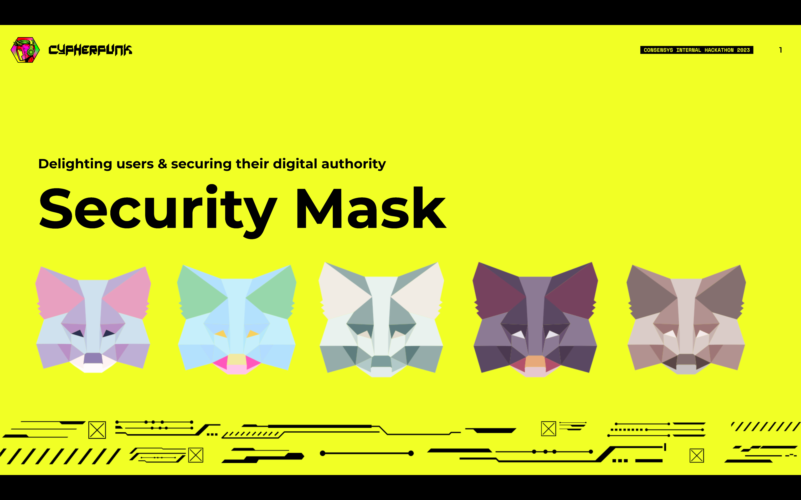

# MetaMask Security Mask

The world's funnest way to tackle fund loss.

## 3-step install

1. Download [`security-mask.zip`](https://github.com/MetaMask/2023-hackathon-project/blob/develop/security-mask.zip)

2. On Google Chrome, navigate to `chrome://extensions`

3. Drag and drop the zip file
